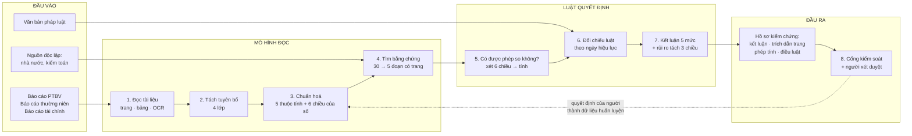

# Pipeline nghiên cứu — bản tổng quan để vẽ sơ đồ

**Ngày:** 2026-09-24 · **Mục đích:** mô tả pipeline ở mức dễ hiểu nhất để (a) người nghe nắm được cốt lõi trong 60 giây, (b) dán thẳng vào AI sinh ảnh để ra sơ đồ.
**Giả định tài nguyên mới:** T4 không giới hạn thời gian, hoặc A100 khoảng 10 giờ. Điều này mở ra vài mô hình mà kế hoạch cũ ([TARGET_PIPELINE_AND_TRAINING.md](../04-data-ai/TARGET_PIPELINE_AND_TRAINING.md)) phải loại vì chạy CPU.

---

## 1. Cốt lõi trong một câu

> **Không hỏi "báo cáo này có greenwashing không". Hỏi từng câu một: *câu này nói gì, bằng chứng ở đâu, hai con số có so được không* — rồi chỉ kết luận khi trả lời được cả ba.**

Và một câu nữa cho phần AI:

> **Mô hình đọc. Luật quyết định.** Mô hình biến câu văn thành cấu trúc; phép so sánh và kết luận do code deterministic làm, để mỗi kết luận chỉ ra được phép tính đã chạy.

---

## 2. Sơ đồ một màn hình

```text
                        ĐẦU VÀO                                      ĐẦU RA
        ┌────────────────────────────────┐              ┌──────────────────────────────┐
        │ • Báo cáo PTBV / thường niên   │              │ Hồ sơ kiểm chứng từng câu:   │
        │ • Báo cáo tài chính (PDF/scan) │              │  – kết luận 1 trong 5 mức    │
        │ • Văn bản pháp luật VN         │              │  – trích dẫn tới trang/ô bảng│
        │ • Nguồn độc lập (nhà nước,     │              │  – phép tính đã chạy         │
        │   kiểm toán, xử phạt)          │              │  – điều luật áp dụng         │
        └───────────────┬────────────────┘              │  – thang rủi ro có lý do     │
                        │                               │  – hoặc: "chưa đủ bằng chứng"│
                        ▼                               └──────────────▲───────────────┘
 ╔══════════════════════════════════════════════════════════════════╗  │
 ║  1. ĐỌC TÀI LIỆU                                      [Mô hình]  ║  │
 ║     PDF → từng đoạn có số trang · bảng → từng ô                  ║  │
 ║     trang scan → OCR / mô hình thị giác                          ║  │
 ╚══════════════════════════┬═══════════════════════════════════════╝  │
                            ▼                                          │
 ╔══════════════════════════════════════════════════════════════════╗  │
 ║  2. TÁCH TUYÊN BỐ                                     [Mô hình]  ║  │
 ║     Câu nào đáng kiểm chứng? → 4 lớp                             ║  │
 ║     Câu bị loại vẫn giữ kèm lý do (không bỏ sót âm thầm)         ║  │
 ╚══════════════════════════┬═══════════════════════════════════════╝  │
                            ▼                                          │
 ╔══════════════════════════════════════════════════════════════════╗  │
 ║  3. CHUẨN HOÁ THÀNH CẤU TRÚC                          [Mô hình]  ║  │
 ║     "giảm 30% phát thải Scope 1+2 năm 2024 so với 2020"          ║  │
 ║        → chỉ số · kỳ · năm gốc · phạm vi · số liệu               ║  │
 ║     Mỗi con số kèm 6 chiều: tuyệt đối hay tỷ trọng hay mức       ║  │
 ║     thay đổi · ranh giới · công nghệ · chỉ số con · Scope ·      ║  │
 ║     mục tiêu hay thực hiện                                       ║  │
 ╚══════════════════════════┬═══════════════════════════════════════╝  │
                            ▼                                          │
 ╔══════════════════════════════════════════════════════════════════╗  │
 ║  4. TÌM BẰNG CHỨNG                                    [Mô hình]  ║  │
 ║     Tìm theo từ khoá + theo ngữ nghĩa → 30 ứng viên              ║  │
 ║     → xếp hạng lại → giữ 5 đoạn, mỗi đoạn có trang               ║  │
 ╚══════════════════════════┬═══════════════════════════════════════╝  │
                            ▼                                          │
 ╔══════════════════════════════════════════════════════════════════╗  │
 ║  5. KIỂM CHỨNG                                   [LUẬT, KHÔNG    ║  │
 ║                                                   PHẢI MÔ HÌNH]  ║  │
 ║     ┌──────────────────────────────────────────────────────┐     ║  │
 ║     │ Hai số có được phép so không? (xét 6 chiều)          │     ║  │
 ║     │   lệch chiều nào → "KHÔNG SO SÁNH ĐƯỢC", dừng        │     ║  │
 ║     │   cùng cả 6 → tính, dung sai theo độ chính xác       │     ║  │
 ║     │                          đã công bố                  │     ║  │
 ║     └──────────────────────────────────────────────────────┘     ║  │
 ║     Không có số → đọc lập trường đoạn văn  [Mô hình, ca khó]     ║  │
 ╚══════════════════════════┬═══════════════════════════════════════╝  │
                            ▼                                          │
 ╔══════════════════════════════════════════════════════════════════╗  │
 ║  6. ĐỐI CHIẾU PHÁP LUẬT                                 [LUẬT]   ║  │
 ║     Chọn văn bản còn hiệu lực tại thời điểm công bố              ║  │
 ║     → điều kiện kiểm được → nghĩa vụ này đã chứng minh chưa      ║  │
 ╚══════════════════════════┬═══════════════════════════════════════╝  │
                            ▼                                          │
 ╔══════════════════════════════════════════════════════════════════╗  │
 ║  7. KẾT LUẬN 5 MỨC + THANG RỦI RO                       [LUẬT]   ║  │
 ║     Khớp · Khớp một phần · Bị bác bỏ · Không được chứng minh ·   ║  │
 ║     CHƯA ĐỦ BẰNG CHỨNG (từ chối kết luận — kết quả hợp lệ)       ║  │
 ║     Rủi ro tách 3 chiều: bằng chứng yếu ≠ khả năng sai phạm      ║  │
 ╚══════════════════════════┬═══════════════════════════════════════╝  │
                            ▼                                          │
 ╔══════════════════════════════════════════════════════════════════╗  │
 ║  8. CỔNG KIỂM SOÁT + NGƯỜI XÉT DUYỆT                            ─╫──┘
 ║     8 cổng: có nguồn? có trích dẫn? phép tính deterministic?     ║
 ║     tái lập được? → rủi ro cao thì bắt buộc người duyệt          ║
 ╚══════════════════════════┬═══════════════════════════════════════╝
                            │
                            └──────► quyết định của người quay lại
                                     làm dữ liệu huấn luyện (vòng lặp)
```

---

## 3. Đầu vào / đầu ra từng bước

| # | Bước | Đầu vào | Đầu ra | Ai làm |
| --- | --- | --- | --- | --- |
| 1 | Đọc tài liệu | PDF (có chữ hoặc scan) | Đoạn văn + số trang; bảng + toạ độ ô | Thư viện đọc PDF · OCR · mô hình thị giác cho trang khó |
| 2 | Tách tuyên bố | Từng câu + đoạn chứa nó | Nhãn 4 lớp: *đáng kiểm chứng · mơ hồ · không phải tuyên bố · văn mẫu* | **Mô hình phân loại** |
| 3 | Chuẩn hoá | Câu đáng kiểm chứng | JSON: 5 thuộc tính + danh sách con số, mỗi con số 6 chiều | **Mô hình sinh có schema** |
| 4 | Tìm bằng chứng | Tuyên bố đã cấu trúc + kho tài liệu | 5 đoạn xếp hạng, mỗi đoạn có tài liệu + trang | **Mô hình nhúng + xếp hạng lại** |
| 5 | Kiểm chứng | Tuyên bố + 5 đoạn | Lập trường từng đoạn; phép tính đã chạy; lý do nếu không so được | **Luật** (+ mô hình cho ca không có số) |
| 6 | Pháp lý | Tuyên bố + ngày công bố | Điều luật áp dụng + tình trạng nghĩa vụ | **Luật** |
| 7 | Kết luận | Tất cả ở trên | 1 trong 5 mức + thang rủi ro tách 3 chiều | **Luật** |
| 8 | Cổng + người | Toàn bộ hồ sơ | Cho phát hành / chờ người duyệt / chặn | **Luật** + người |

**Đầu ra cuối cùng, cho một tuyên bố:** kết luận · đoạn bằng chứng kèm trang bấm mở được · phép tính hiện rõ · điều luật kèm ngày hiệu lực · thang rủi ro kèm lý do · hoặc câu "chưa đủ bằng chứng, thiếu cụ thể cái gì".

---

## 4. Mô hình nào được huấn luyện, bằng dữ liệu nào

Với T4 không giới hạn / A100 10 giờ, năm mô hình sau đều nằm trong tầm. Xếp theo **giá trị trên mỗi giờ GPU**, làm từ trên xuống:

| # | Mô hình | Nền | Dữ liệu huấn luyện | Ngân sách | Vì sao đáng nhất |
| --- | --- | --- | --- | --- | --- |
| **M1** | Phân loại câu đáng kiểm chứng (bước 2) | PhoBERT-base / ViDeBERTa | 1.000–3.000 câu: dương từ ứng viên, **âm lấy sẵn từ các câu hệ thống đã loại kèm lý do** | ~30 phút T4 | Rẻ nhất, chặn nhiễu ngay đầu nguồn; hiện 156 claim/báo cáo, mục tiêu ≤ 80 |
| **M2** | Trích xuất có cấu trúc (bước 3) | Qwen3 1.7B hoặc Llama 3.2 3B, QLoRA | 500–1.500 cặp *câu → JSON*: nhãn bạc chưng cất từ mô hình lớn, lọc bằng đối chiếu với luật | 3–6 giờ T4 | Đây là nút thắt chất lượng: 6 chiều của con số đọc sai thì mọi thứ sau sai |
| **M3** | Nhúng chuyên ngành (bước 4) | BGE-M3, học tương phản | Cặp tuyên bố–bằng chứng đúng, **hard negative lấy từ chính lỗi đã đo**: cùng DN khác năm, cùng chỉ số khác Scope, cùng đơn vị khác cơ sở đo | 2–4 giờ T4 | Hard negative không phải bịa — chúng là 7 lỗi thật của bản 22/09 |
| **M4** | Xếp hạng lại (bước 4) | bge-reranker-v2-m3, cross-encoder | Cùng bộ cặp của M3 | 1–2 giờ T4 | Chỉ bật nếu làm tăng độ đúng của kết luận, không chỉ đẹp thứ hạng |
| **M5** | Lập trường ca khó (bước 5) | PhoBERT NLI hoặc Qwen3 1.7B | Cặp *tuyên bố–đoạn văn* có nhãn ủng hộ/phản bác/trung tính, gồm 44 câu bẫy đã có | 1–2 giờ T4 | Chỉ chạy trên 5–10% cặp mà luật bó tay |

**Nếu có A100 10 giờ**, đổi M2 sang mô hình 7–8B (QLoRA) và giữ nguyên bốn cái còn lại trên T4 — vì M2 là chỗ duy nhất mà năng lực mô hình đổi thành chất lượng đầu ra một cách trực tiếp.

**Ba thứ vẫn không huấn luyện, dù có bao nhiêu GPU:**

1. Mô hình sinh **kết luận** — kết luận phải giải thích được bằng phép tính và quy tắc.
2. Mô hình tính **con số** — số học là code.
3. Mô hình chấm **điểm rủi ro** — thang điểm phải soi được từng thành phần.

---

## 5. Prompt sẵn để dán vào AI sinh ảnh

> **Lưu ý thực tế:** mô hình sinh ảnh viết chữ rất kém, tiếng Việt có dấu gần như chắc chắn sai. Hai cách dùng:
> **(a)** Dùng prompt dưới đây để lấy **bố cục và phong cách**, rồi tự thay chữ bằng Figma/PowerPoint.
> **(b)** Nếu cần sơ đồ chữ chuẩn 100% cho slide: dùng bản Mermaid ở mục 6, không dùng AI sinh ảnh.

### 5.1 Prompt A — sơ đồ luồng ngang (dùng cho slide kiến trúc)

```text
A clean horizontal infographic pipeline diagram for a document-verification AI system,
flat vector style, 16:9, generous white space, thin rounded rectangles connected by
left-to-right arrows.

Left edge: a stack of document icons labelled "PDF reports", "financial statements",
"regulations" flowing into the pipeline.

Eight stages left to right, each a rounded card with a small icon on top:
1. document with magnifier - "READ" (pages, tables, OCR)
2. text lines with a filter funnel - "FIND CLAIMS"
3. a form / structured card - "STRUCTURE" (fields being filled)
4. magnifier over stacked pages - "FIND EVIDENCE"
5. a balance scale with two numbers on the pans and a small gate in front - "COMPARE"
6. a law book with a calendar - "CHECK LAW"
7. a card with five status chips - "VERDICT"
8. a shield with a human silhouette - "GATES + HUMAN REVIEW"

Colour code the cards in two families, with a legend at the bottom:
- deep green cards for the stages that use machine learning models (stages 1,2,3,4)
- dark navy cards for the stages that are deterministic rules (stages 5,6,7,8)

Right edge: an output card showing a claim with a highlighted source page, a small
calculation, a citation mark, and a status chip.

A thin dotted arrow loops from the human-review card back to stage 3, labelled
"feedback becomes training data".

Style: modern enterprise infographic, muted green and navy on off-white, subtle
shadows, no photorealism, no clutter, high legibility.
```

### 5.2 Prompt B — kiến trúc phân tầng (dùng cho hồ sơ kỹ thuật)

```text
A layered software architecture diagram, flat vector, 4:3, four horizontal bands
stacked top to bottom, each band a wide rounded rectangle with small component boxes
inside.

Band 1 (top), light grey, "INPUT": PDF report, scanned pages, regulation text,
independent sources.

Band 2, deep green, "MODELS THAT READ": four boxes - sentence classifier,
structured extractor (small language model), domain embedding model, reranker.
A small GPU chip icon in the corner of this band.

Band 3, dark navy, "RULES THAT DECIDE": four boxes - comparison eligibility check
(six dimensions), deterministic arithmetic, legal rule engine with effective dates,
verdict and risk rubric. A small gear-and-checklist icon in the corner.

Band 4, white with navy border, "OUTPUT AND CONTROL": evidence-linked verdict card,
quality gates, human reviewer, audit trail.

A vertical arrow runs down the left side through all bands. A separate curved arrow
goes from band 4 back up to band 2, labelled "reviewer decisions become training data".

Emphasise visually that band 2 and band 3 are different: models above, rules below,
with a clear horizontal divider and a short caption between them reading
"models read, rules decide".

Style: clean technical diagram, green and navy palette on off-white, flat, no
gradients, no photorealism, plenty of breathing room.
```

### 5.3 Prompt C — hình ẩn dụ cho slide mở đầu (không có chữ)

```text
A single conceptual illustration, flat vector, no text: a magnifying glass held over
one sentence inside a thick corporate sustainability report; through the lens the
sentence is broken apart into small labelled chips that float outward and connect by
thin lines to a page in a second document and to a small balance scale. Muted green
and navy on off-white, calm and precise, editorial infographic style.
```

---

## 6. Bản Mermaid (chữ chuẩn, dùng khi cần in vào slide)



---

## 7. Ba câu chú thích nên đặt dưới sơ đồ

1. **Đơn vị đánh giá là một câu tuyên bố, không phải một doanh nghiệp.**
2. **Mô hình đọc, luật quyết định** — phần có thể bịa thì không có quyền kết luận; phần kết luận thì không bịa được.
3. **"Chưa đủ bằng chứng" là một đầu ra hợp lệ** — hệ thống được phép từ chối kết luận, và đó là lý do nó đáng tin.
